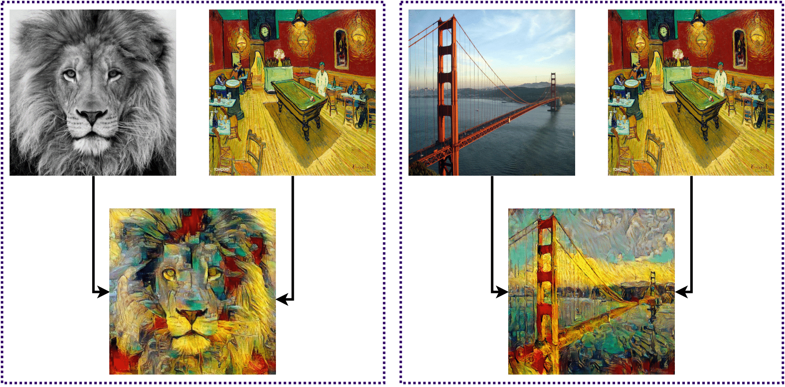

# Neural Style Transfer: A Technical Report

[](https://pytorch.org/)
[](https://opensource.org/licenses/MIT)

[Jitesh Jain](https://praeclarumjj3.github.io/)<sup>&dagger;</sup>, [Divyansh Agarwal](https://github.com/div794)<sup>&dagger;</sup>, [Gagan Sharma](https://gagansh7171.github.io/#/)<sup>&dagger;</sup>, [R Chinmay](https://github.com/rchinmay)<sup>&dagger;</sup>, [Md Junaid Mahmood](https://github.com/MdJunaidMahmood)<sup>&dagger;</sup>

[[`proposal`](data/proposal.pdf)] [[`mid-term report`](data/mid_report.pdf)]

## Contents

1. [Overview](#1-overview)
2. [Setup Instructions](#2-setup-instructions)
3. [Experiments](#3-experiments)

## 1. Overview

This repo contains the code for our work **Neural Style Transfer: A Technical Report** done as a part of *CSN-526: Machine Learning course project*.



## 2. Setup Instructions

- Clone the repo:

    ```.bash
    git clone https://github.com/praeclarumjj3/NST-Tech.git
    cd NST-Tech
    ```

- Create a conda environment:

    ```.bash
    conda env create -f conda_env.yml
    conda activate nst
    ```

## 3. Experiments

### Training

- Execute the following command to run style transfer:

    ```bash
    sh nst.sh
    ```

>Note: There are arguments specified in the `nst.sh` script. Please modify them to run experiments under different settings.

- You may specify the `content` and `style` images to be used from the [data/content](data/content) and [data/style](data/style) folders respectively.

### Evaluation

- We use the predictions from the [AdaIn-Style](https://github.com/xunhuang1995/AdaIN-style) method proposed in [Arbitrary Style Transfer in Real-time with Adaptive Instance Normalization](https://arxiv.org/abs/1703.06868) as ground truths while evaluating the performance of our method.

- Install [`image-similarity-measures`](https://github.com/up42/image-similarity-measures):

    ```.bash
    pip install image-similarity-measures[speedups]
    ```

- Execute the following command to calculate the `PSNR`, `SSIM` and `RMSE` scores:

    ```.bash
    sh metrics.sh [path-to-gt] [path-to-our-prediction]
    ```

>Note: The gts can be found in the [`data/gts/`](data/gts/) directory. You may specify more metrics in the [metrics.sh](metrics.sh) script.

## Acknowledgement

This repo is a part of our course project for CSN-526: Machine Learning under [Professor Pravendra Singh](https://sites.google.com/view/pravendra/) at CSE Department, IIT Roorkee. The code is open-sourced under the MIT License.

### Team Members

- #### Jitesh Jain: 19114039

- #### Divyansh Agarwal: 19115055

- #### Gagan Sharma: 19114032

- #### R Chinmay: 19114067

- #### Md Junaid Mahmood: 19116040
